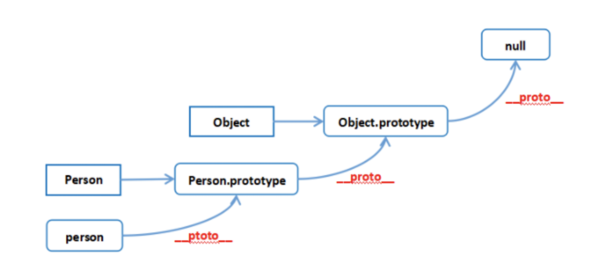
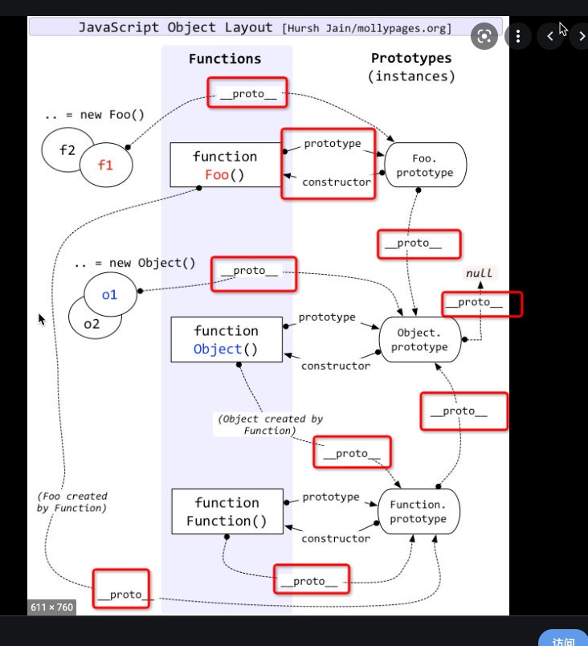
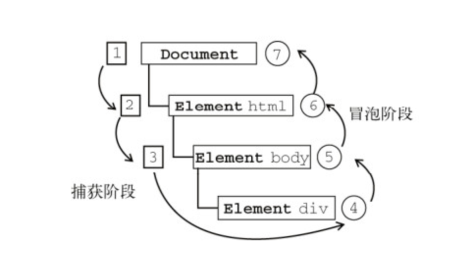

## 1、JS有几种数据类型,其中基本数据类型有哪些?
* 七种数据类型
Boolean
Null
Undefined
Number
String
Symbol (ECMAScript 6 新定义)
Object
(ES6之前)其中5种为基本类型:string,number,boolean,null,undefined,
ES6出来的Symbol也是原始数据类型 ，表示独一无二的值
Object为引用类型(范围挺大),也包括数组、函数。

## 2、Promise 构造函数是同步执行还是异步执行，那么 then 方法呢？
promise构造函数是同步执行的，then方法是异步执行的
Promise new的时候会立即执行里面的代码 then是微任务 会在本次任务执行完的时候执行 setTimeout是宏任务 会在下次任务执行的时候执行
```javascript
const promise = new Promise((resolve, reject) => {
  console.log(1)
  resolve()
  console.log(2)
})

promise.then(() => {
  console.log(3)
})

console.log(4)
//1,2,4,3
```
## 3、JS的四种设计模式
* 工厂模式 
简单的工厂模式可以理解为解决多个相似的问题;
```javascript
function CreatePerson(name,age,sex) {
    var obj = new Object();
    obj.name = name;
    obj.age = age;
    obj.sex = sex;
    obj.sayName = function(){
        return this.name;
    }
    return obj;
}
var p1 = new CreatePerson("longen",'28','男');
var p2 = new CreatePerson("tugenhua",'27','女');
console.log(p1.name); // longen
console.log(p1.age);  // 28
console.log(p1.sex);  // 男
console.log(p1.sayName()); // longen

console.log(p2.name);  // tugenhua
console.log(p2.age);   // 27
console.log(p2.sex);   // 女
console.log(p2.sayName()); // tugenhua  
```
* 单例模式
只能被实例化(构造函数给实例添加属性与方法)一次
```javascript
// 单体模式
var Singleton = function(name){
    this.name = name;
};
Singleton.prototype.getName = function(){
    return this.name;
}
// 获取实例对象
var getInstance = (function() {
    var instance = null;
    return function(name) {
        if(!instance) {//相当于一个一次性阀门,只能实例化一次
            instance = new Singleton(name);
        }
        return instance;
    }
})();
// 测试单体模式的实例,所以a===b
var a = getInstance("aa");
var b = getInstance("bb");  
```
* 沙箱模式
将一些函数放到自执行函数里面,但要用闭包暴露接口,用变量接收暴露的接口,再调用里面的值,否则无法使用里面的值
```javascript
let sandboxModel=(function(){
    function sayName(){};
    function sayAge(){};
    return{
        sayName:sayName,
        sayAge:sayAge
    }
})()
```
* 发布者订阅模式
例如我们关注了某一个公众号,然后他对应的有新的消息就会给你推送,代码实现逻辑是用数组存贮订阅者, 发布者回调函数里面通知的方式是遍历订阅者数组,并将发布者内容传入订阅者数组
```javascript
//发布者与订阅模式
var shoeObj = {}; // 定义发布者
shoeObj.list = []; // 缓存列表 存放订阅者回调函数

// 增加订阅者
shoeObj.listen = function(fn) {
    shoeObj.list.push(fn); // 订阅消息添加到缓存列表
}

// 发布消息
shoeObj.trigger = function() {
    for (var i = 0, fn; fn = this.list[i++];) {
        fn.apply(this, arguments);//第一个参数只是改变fn的this,
    }
}
// 小红订阅如下消息
shoeObj.listen(function(color, size) {
    console.log("颜色是：" + color);
    console.log("尺码是：" + size);
});

// 小花订阅如下消息
shoeObj.listen(function(color, size) {
    console.log("再次打印颜色是：" + color);
    console.log("再次打印尺码是：" + size);
});
shoeObj.trigger("红色", 40);
shoeObj.trigger("黑色", 42);  
```

## 4、列举出集中创建实例的方法
* 1.字面量
```javascript
let obj={'name':'张三'}
```
* 2.Object构造函数创建
```javascript
let Obj=new Object()
Obj.name='张三'
```
* 3.使用工厂模式创建对象
```javascript
function createPerson(name){
 var o = new Object();
 o.name = name;
 };
 return o; 
}
var person1 = createPerson('张三');
```
* 4.使用构造函数创建对象
```javascript
function Person(name){
 this.name = name;
}
var person1 = new Person('张三');
```

## 5、简述一下原型 / 构造函数 / 实例
* 原型(prototype): 一个简单的对象，用于实现对象的 属性继承。可以简单的理解成对象的爹。在 Firefox 和 Chrome 中，每个JavaScript对象中都包含一个__proto__(非标准)的属性指向它爹(该对象的原型)，可obj.__proto__进行访问。
* 构造函数: 可以通过new来 新建一个对象的函数。
* 实例: 通过构造函数和new创建出来的对象，便是实例。实例通过__proto__指向原型，通过constructor指向构造函数。
这里来举个栗子，以Object为例
__proto__隐式原型
prototype显示原型
```javascript
//实例.__proto__ === 原型
//原型(实例).constructor === 构造函数
//构造函数.prototype === 原型
const o = new Object();
o.__proto__=== Object.prototype;//true
Object.prototype.constructor === Object;//true
o.constructor === Object;//true
```
得出如下结论：
* 构造函数的prototype(Object.prototype)与实例的__proto__(o.__proto__)都指向原型
* 实例的constructor(o.constructor)与原型的constructor(Object.prototype.constructor)都指向构造函数

Function 既是构造函数又是实例【通过调用 Function 这个构造函数生成的】，由 Function 生成的实例对象隐式原型指向相应的构造函数的显示原型
但 Function.__proto__ 或 Function.prototype 是对象，对象就必然最终由 Object 生成，所以 fnObj.__proto__ === Object.prototype
```javascript 
Function.__proto__ === Function.prototype; //true
Function.__proto__.__proto__ === Object.prototype;//true
Function.prototype.__proto__ === Object.prototype;//true
```
## 5.1、原型，原型链总结
__proto__作为不同对象之间的桥梁，用来指向创建它的构造函数的原型对象的
 
1、每个对象的__proto__都是指向它的构造函数的原型对象prototype的
```javascript
person.__proto__ === Person.prototype
```
2、构造函数是一个函数对象，是通过 Function构造器产生的
```javascript
Person.__proto__ === Function.prototype
```
3、原型对象本身是一个普通对象，而普通对象的构造函数都是Object
```javascript
Person.prototype.__proto__ === Object.prototype
```
4、所有的构造器都是函数对象，函数对象都是 Function构造产生的
```javascript
Object.__proto__ === Function.prototype
```
5、Object的原型对象也有__proto__属性指向null，null是原型链的顶端
```javascript
Object.prototype.__proto__ === null
```
总结：
* 一切对象都是继承自Object对象，Object 对象直接继承根源对象null
* 一切的函数对象（包括 Object 对象），都是继承自 Function 对象
* Object 对象直接继承自 Function 对象
* Function对象的__proto__会指向自己的原型对象，最终还是继承自Object对象
 

## 6、简述一下JS继承，并举例
在 JS 中，继承通常指的便是 原型链继承，也就是通过指定原型，并可以通过原型链继承原型上的属性或者方法。
* 最优化: 组合继承
```javascript
function clone (parent, child) {
    // 这里改用 Object.create 就可以减少组合继承中多进行一次构造的过程
    child.prototype = Object.create(parent.prototype);
    child.prototype.constructor = child;
}
function Parent() {
    this.name = 'parent6';
    this.play = [1, 2, 3];
}
Parent6.prototype.getName = function () {
    return this.name;
}
function Child() {
    Parent.call(this);
    this.friends = 'child5';
}
clone(Parent, Child);
```
* 使用 ES6 的语法糖 class / extends

## 7、函数柯里化
函数柯里化指的是将能够接收多个参数的函数转化为接收单一参数的函数，并且返回接收余下参数且返回结果的新函数的技术。
函数柯里化的主要作用和特点就是参数复用、提前返回和延迟执行。
在一个函数中，首先填充几个参数，然后再返回一个新的函数的技术，称为函数的柯里化。通常可用于在不侵入函数的前提下，为函数**预置通用参数**，供多次重复调用。
```javascript
const add = function add(x) {
    return function (y) {
        return x + y
    }
}
const add1 = add(1)
add1(2) === 3
add1(20) === 21
```

## 8、箭头函数的特点
```javascript
function a() {
    return () => {
        return () => {
            console.log(this)
        }
    }
}
console.log(a()()())//window
```
箭头函数其实是没有 this的，这个函数中的 this只取决于他外面的第一个不是箭头函数的函数的 this。在这个例子中，因为调用 a符合前面代码中的第一个情况，所以 this是 window。并且 this一旦绑定了上下文，就不会被任何代码改变。


## 9、浏览器与Node的事件循环(Event Loop)有何区别?
浏览器和 Node 环境下，microtask 任务队列的执行时机不同

Node 端，microtask 在事件循环的各个阶段之间执行
浏览器端，microtask 在事件循环的 macrotask 执行完之后执行

## 10、什么是闭包，应用场景？
一个函数和对其周围状态的引用捆绑在一起，这样的组合就是闭包。闭包让你可以在一个内层函数中访问到其外层函数的作用域。
使用场景：1、创建私有变量，2、延长变量的生命周期

## 11、Javascript中的作用域
作用域，即变量（变量作用域又称上下文）和函数能被访问的区域或集合。作用域决定了代码区块中变量和其他资源的可见性。
作用域分为：
* 全局作用域
* 函数作用域
* 块级作用域
JavaScript 遵循的是词法作用域:词法作用域，又叫静态作用域，变量被创建时就确定好了，而非执行阶段确定的
```javascript
var a = 2;
function foo(){
    console.log(a)
}
function bar(){
    var a = 3;
    foo();
}
bar()//2
//由于JavaScript遵循词法作用域，相同层级的 foo 和 bar 就没有办法访问到彼此块作用域中的变量，所以输出2
```
作用域链:当在Javascript中使用一个变量的时候，首先Javascript引擎会尝试在当前作用域下去寻找该变量，如果没找到，再到它的上层作用域寻找，以此类推直到找到该变量或是已经到了全局作用域

## 12、执行上下文和执行栈
执行上下文是对Javascript代码执行环境的一种抽象概念，只要有Javascript代码运行，那么它就一定是运行在执行上下文中。
* 全局执行上下文：只有一个，浏览器中的全局对象就是 window对象，this 指向这个全局对象
* 函数执行上下文：存在无数个，只有在函数被调用的时候才会被创建，每次调用函数都会创建一个新的执行上下文
* Eval 函数执行上下文：指的是运行在 eval 函数中的代码，很少用而且不建议使用

执行上下文的生命周期包括三个阶段：创建阶段 → 执行阶段 → 回收阶段
创建阶段：会在代码中扫描变量和函数声明，然后将函数声明存储在环境中
执行阶段：执行变量赋值、代码执行
回收阶段：执行上下文出栈等待虚拟机回收执行上下文

执行栈：执行栈，也叫调用栈，具有 LIFO（后进先出）结构，用于存储在代码执行期间创建的所有执行上下文
* 当Javascript引擎开始执行你第一行脚本代码的时候，它就会创建一个全局执行上下文然后将它压到执行栈中
* 每当引擎碰到一个函数的时候，它就会创建一个函数执行上下文，然后将这个执行上下文压到执行栈中
* 引擎会执行位于执行栈栈顶的执行上下文(一般是函数执行上下文)，当该函数执行结束后，对应的执行上下文就会被弹出，然后控制流程到达执行栈的下一个执行上下文

## 13、this对象的理解
在绝大多数情况下，函数的调用方式决定了 this 的值（运行时绑定），this 关键字是函数运行时自动生成的一个内部对象，只能在函数内部使用，总指向调用它的对象。
箭头函数：箭头函语法，让我们在代码书写时就能确定 this 的指向（编译时绑定）。


## 14、JavaScript中的事件模型
* 1.事件与事件流
javascript中的事件，可以理解就是在HTML文档或者浏览器中发生的一种交互操作，使得网页具备互动性， 常见的有加载事件、鼠标事件、自定义事件等
事件流三个阶段：
事件捕获阶段(capture phase)
处于目标阶段(target phase)
事件冒泡阶段(bubbling phase)


* 2.事件模型
事件模型可以分为三种：
原始事件模型（DOM0级）:只支持冒泡，不支持捕获；同一个类型的事件只能绑定一次
```javascript
//两种绑定方式
// <input type="button" onclick="fun()">
var btn = document.getElementById('.btn');
btn.onclick = fun
```
标准事件模型（DOM2级）:该事件模型中，一次事件共有三个过程捕获、目标、冒泡阶段；一个DOM元素上绑定多个事件处理器，各自并不会冲突
```javascript
//绑定
addEventListener(eventType, handler, useCapture)
//移除
removeEventListener(eventType, handler, useCapture)
/**
 * eventType指定事件类型(不要加on)
 * handler是事件处理函数
 * useCapture是一个boolean用于指定是否在捕获阶段进行处理，一般设置为false与IE浏览器保持一致
 */
```
IE事件模型（基本不用）

## 15、什么是事件代理？应用场景
事件代理，通俗地来讲，就是把一个元素响应事件（click、keydown......）函数委托到另一个元素上
事件委托，会把一个或者一组元素的事件委托到它的父层或者更外层元素上，真正绑定事件的是外层元素，而不是目标元素
应用场景：大量的列表项，动态增加或删除列表项元素
优点：减少整个页面所需的内存，提升整体性能；动态绑定，减少重复工作
局限性：focus、blur事件没有冒泡机制，无法进行委托绑定；mousemove、mouseout这样的事件，虽然有事件冒泡，但是只能不断通过位置去计算定位，对性能消耗高，因此也是不适合于事件委托的

## 16、typeof 与 instanceof 区别
typeof 操作符返回一个字符串，表示未经计算的操作数的类型 
instanceof 运算符用于检测构造函数的 __proto__ 属性是否出现在某个实例对象的原型链上prototype
```javascript
//模拟instanceof
function instance(left,right){
    let prototype = right.prototype;
    let proto = left.__proto__;
    while(true){
        if(proto === null){
            return false;
        }
        if(proto === prototype){
            return true;
        }
        proto = proto.__proto__;
    }
}
```
typeof与instanceof都是判断数据类型的方法
typeof会返回一个变量的基本类型，instanceof返回的是一个布尔值
如果需要通用检测数据类型，可以采用Object.prototype.toString，调用该方法，统一返回格式“[object Xxx]”的字符串

## 17、 JavaScript 中内存泄漏的几种情况
内存泄漏（Memory leak）是在计算机科学中，由于疏忽或错误造成程序未能释放已经不再使用的内存
* 垃圾回收机制
标记清除：垃圾回收程序运行的时候，会标记内存中存储的所有变量。然后，它会将所有在上下文中的变量，以及被在上下文中的变量引用的变量的标记去掉。随后垃圾回收程序做一次内存清理，销毁带标记的所有值并收回它们的内存。
引用计数：语言引擎有一张"引用表"，保存了内存里面所有的资源（通常是各种值）的引用次数。如果一个值的引用次数是0，就表示这个值不再用到了，因此可以将这块内存释放。
* 常见内存泄露情况
意外的全局变量、定时器、闭包（维持函数内局部变量）、没有清理对DOM元素的引用、包括使用事件监听addEventListener监听的时候


## 18、函数式编程的理解？优缺点？
函数式编程：简单来讲，就是要把过程逻辑写成函数，定义好输入参数，只关心它的输出结果
纯函数：函数式编程旨在尽可能的提高代码的无状态性和不变性。要做到这一点，就要学会使用无副作用的函数，也就是纯函数
高阶函数：就是以函数作为输入或者输出的函数被称为高阶函数
柯里化：把一个多参数函数转化成一个嵌套的一元函数的过程
```javascript
// 多参数柯里化；
const curry = function(fn){
    return function curriedFn(...args){
        if(args.length<fn.length){
            return function(){
                return curriedFn(...args.concat([...arguments]));
            }
        }
        return fn(...args);
    }
}
const fn = (x,y,z,a)=>x+y+z+a;
const myfn = curry(fn);
console.log(myfn(1)(2)(3)(1));
```
组合与管道：组合函数，目的是将多个函数组合成一个函数。compose执行是从右到左的。而管道函数，执行顺序是从左到右执行的
```javascript
function afn(a){
    return a*2;
}
function bfn(b){
    return b*3;
}
const compose = (a,b)=>c=>a(b(c));
let myfn =  compose(afn,bfn);
console.log( myfn(2));
const compose = (...fns)=>val=>fns.reverse().reduce((fn0,fn1)=>fn1(fn0),val);//组合函数
const pipe = (...fns)=>val=>fns.reduce((fn0,fn1)=>fn1(fn0),val);//管道函数
```
函数式优缺点
优点：更好的管理状态、更简单的复用、更优雅的组合、减少代码量，提高维护性
缺点：性能(过度包装)、资源占用、递归陷阱

## 19、 JavaScript 数字精度丢失的问题
计算机存储双精度浮点数需要先把十进制数转换为二进制的科学记数法的形式，然后计算机以自己的规则{符号位+(指数位+指数偏移量的二进制)+小数部分}存储二进制的科学记数法

因为存储时有位数限制（64位），并且某些十进制的浮点数在转换为二进制数时会出现无限循环，会造成二进制的舍入操作(0舍1入)，当再转换为十进制时就造成了计算误差

解决方案
```javascript
parseFloat(1.4000000000000001.toPrecision(12)) === 1.4  // True
parseFloat(1.4000000000000001.toFixed(12)) === 1.4 // True
/**
 * 精确加法
 */
//把小数转成整数后再运算
function add(num1, num2) {
  const num1Digits = (num1.toString().split('.')[1] || '').length;
  const num2Digits = (num2.toString().split('.')[1] || '').length;
  const baseNum = Math.pow(10, Math.max(num1Digits, num2Digits));
  return (num1 * baseNum + num2 * baseNum) / baseNum;
}
```

## 20、事件冒泡与捕获
事件冒泡：事件会从最内层的元素开始发生，一直向上传播，直到document对象。
事件捕获：与事件冒泡相反，事件会从最外层开始发生，直到最具体的元素。
e.preventDefault();阻止默认事件
e.stopPropagation();阻止冒泡

## 21、js作用域的理解
作用域，是指变量的生命周期
全局变量：
生命周期将存在于整个程序之内。
能被程序中任何函数或者方法访问。
函数作用域：
函数作用域内，对外是封闭的，从外层的作用域无法直接访问函数内部的作用域
块级作用域：
let 和 const 关键字，创建块级作用域的条件是必须有一个 { } 包裹
词法作用域：javascript采用的是静态作用域
法作用域是指一个变量的可见性，当我们要使用声明的变量时：JS引擎总会从最近的一个域，向外层域查找
动态作用域：
在 JavaScript 中的仅存的应用动态作用域的地方：this 引用

## 22、JavaScript执行机制 事件循环/微任务/宏任务
● JavaScript是单线程的语言
● Event Loop是javascript的执行机制
事件循环:
 
● 同步和异步任务分别进入不同的执行"场所"，同步的进入主线程，异步的进入Event Table(事件列表)并注册函数
● 当指定的事情完成时，Event Table会将这个函数移入Event Queue。
● 主线程内的任务执行完毕为空，会去Event Queue读取对应的函数，进入主线程执行。
● 上述过程会不断重复，也就是常说的Event Loop(事件循环)。

### 23、JavaScript原型、原型链和继承
prototype 和 __proto__:
● 每个对象都有一个__proto__属性，并且指向它的prototype原型对象
● 每个构造函数都有一个prototype原型对象
  ○ prototype原型对象里的constructor指向构造函数本身
原型链:
每个对象都有一个__proto__，它指向它的prototype原型对象，而prototype原型对象又具有一个自己的prototype原型对象，就这样层层往上直到一个对象的原型prototype为null,这个查询的路径就是原型链
JavaScript 中的继承:
```javascript
function Person (name, age) {
    this.name = name;
    this.age = age;
}
// 方法定义再构造函数的原型上
Person.prototype.getName = function () { console.log(this.name) };
// 属性的继承
function Teacher (name, age, subject){
    Person.call(this,name,age);
    this.subject = subject;
}
//方法继承
Teacher.prototype = Object.create(Person.prototype);
Teacher.prototype.constructor = Teacher;
```

## 24、Generator 
Generator 函数就是一个封装的异步任务，或者说是异步任务的容器。异步操作需要暂停的地方，都用 yield 语句注明。
Generator 函数的执行方法如下：
```javascript
function* gen(x){
  var y = yield x + 2;
  return y;
}
var g = gen(1);
g.next() // { value: 3, done: false }
g.next() // { value: undefined, done: true }
```
next 方法的作用是分阶段执行 Generator 函数。每次调用 next 方法，会返回一个对象，表示当前阶段的信息（ value 属性和 done 属性）。value 属性是 yield 语句后面表达式的值，表示当前阶段的值；done 属性是一个布尔值，表示 Generator 函数是否执行完毕，即是否还有下一个阶段。
```javascript
function* gen(x){
  var y = yield x + 2;
  return y;
}
var g = gen(1);
g.next() // { value: 3, done: false }
g.next(2) // { value: 2, done: true }
```
上面代码中，第一个 next 方法的 value 属性，返回表达式 x + 2 的值（3）。第二个 next 方法带有参数2，这个参数可以传入 Generator 函数，作为上个阶段异步任务的返回结果，被函数体内的变量 y 接收。因此，这一步的 value 属性，返回的就是2（变量 y 的值）。

## 25、definedProperty 
Object.definedProperty()方法会直接在一个对象上定义一个新的属性，或修改一个对象的现有属性，并返回此对象。
Object.defineProperty(obj, prop, descriptor)
obj:待修改的对象
prop: 要修改(如果不存在即是新增)的属性.
descriptor: 属性的属性描述符，也是需要重点关注的对象。
支持两类描述符，只能二选一使用
● 数据描述符
```javascript
{
	configurable: false,//是否可以被删除
	enumerable: false,//是否可以被枚举
	value: undefined,//属性值
	writable: false,//是否可以重新赋值
}
```
● 存取描述符
```javascript
{
  get: function() {
	return 123;
  },,
  set: function(value) {
    this._a = value;
  },,
}
```


