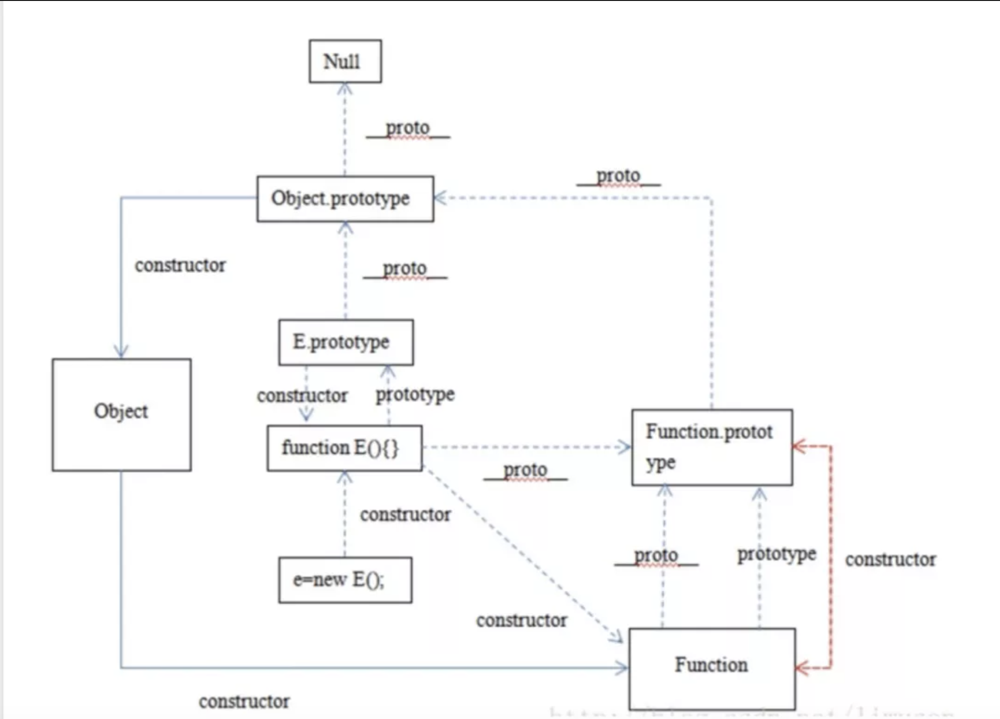

## 1、ES5的继承和ES6的继承有什么区别？
ES5的继承时通过prototype或构造函数机制来实现。ES5的继承实质上是先创建子类的实例对象，然后再将父类的方法添加到this上（Parent.apply(this)）。

ES6的继承机制完全不同，实质上是先创建父类的实例对象this（所以必须先调用父类的super()方法），然后再用子类的构造函数修改this。

具体的：ES6通过class关键字定义类，里面有构造方法，类之间通过extends关键字实现继承。子类必须在constructor方法中调用super方法，否则新建实例报错。因为子类没有自己的this对象，而是继承了父类的this对象，然后对其进行加工。如果不调用super方法，子类得不到this对象。

ps：super关键字指代父类的实例，即父类的this对象。在子类构造函数中，调用super后，才可使用this关键字，否则报错。

## 2、setTimeout、Promise、Async/Await 的区别


## 3、HTTPS 握手过程中，客户端如何验证证书的合法性
* 首先什么是HTTP协议?
http协议是超文本传输协议，位于tcp/ip四层模型中的应用层；通过请求/响应的方式在客户端和服务器之间进行通信；但是缺少安全性，http协议信息传输是通过明文的方式传输，不做任何加密，相当于在网络上裸奔；容易被中间人恶意篡改，这种行为叫做中间人攻击；

* 加密通信：
为了安全性，双方可以使用对称加密的方式key进行信息交流，但是这种方式对称加密秘钥也会被拦截，也不够安全，进而还是存在被中间人攻击风险；于是人们又想出来另外一种方式，使用非对称加密的方式；使用公钥/私钥加解密；通信方A发起通信并携带自己的公钥，接收方B通过公钥来加密对称秘钥；然后发送给发起方A；A通过私钥解密；双发接下来通过对称秘钥来进行加密通信；但是这种方式还是会存在一种安全性；中间人虽然不知道发起方A的私钥，但是可以做到偷天换日，将拦截发起方的公钥key;并将自己生成的一对公/私钥的公钥发送给B；接收方B并不知道公钥已经被偷偷换过；按照之前的流程，B通过公钥加密自己生成的对称加密秘钥key2;发送给A；这次通信再次被中间人拦截，尽管后面的通信，两者还是用key2通信，但是中间人已经掌握了Key2;可以进行轻松的加解密；还是存在被中间人攻击风险；

* 解决困境：权威的证书颁发机构CA来解决；
制作证书：作为服务端的A，首先把自己的公钥key1发给证书颁发机构，向证书颁发机构进行申请证书；证书颁发机构有一套自己的公私钥，CA通过自己的私钥来加密key1,并且通过服务端网址等信息生成一个证书签名，证书签名同样使用机构的私钥进行加密；制作完成后，机构将证书发给A；

校验证书真伪：当B向服务端A发起请求通信的时候，A不再直接返回自己的公钥，而是返回一个证书；

说明：各大浏览器和操作系统已经维护了所有的权威证书机构的名称和公钥。B只需要知道是哪个权威机构发的证书，使用对应的机构公钥，就可以解密出证书签名；接下来，B使用同样的规则，生成自己的证书签名，如果两个签名是一致的，说明证书是有效的；签名验证成功后，B就可以再次利用机构的公钥，解密出A的公钥key1;接下来的操作，就是和之前一样的流程了；

* 中间人是否会拦截发送假证书到B呢？
因为证书的签名是由服务器端网址等信息生成的，并且通过第三方机构的私钥加密中间人无法篡改；所以最关键的问题是证书签名的真伪；

* https主要的思想是在http基础上增加了ssl安全层，即以上认证过程；

## 4、TCP三次握手和四次挥手
三次握手之所以是三次是保证client和server均让对方知道自己的接收和发送能力没问题而保证的最小次数。

第一次client => server 只能server判断出client具备发送能力 第二次 server => client client就可以判断出server具备发送和接受能力。此时client还需让server知道自己接收能力没问题于是就有了第三次 第三次 client => server 双方均保证了自己的接收和发送能力没有问题

其中，为了保证后续的握手是为了应答上一个握手，每次握手都会带一个标识 seq，后续的ACK都会对这个seq进行加一来进行确认。


## 5、React 中 setState 什么时候是同步的，什么时候是异步的？
在React中，如果是由React引发的事件处理（比如通过onClick引发的事件处理），调用setState不会同步更新this.state，除此之外的setState调用会同步执行this.state。所谓“除此之外”，指的是绕过React通过addEventListener直接添加的事件处理函数，还有通过setTimeout/setInterval产生的异步调用。

* 原因：在React的setState函数实现中，会根据一个变量isBatchingUpdates判断是直接更新this.state还是放到队列中回头再说，而isBatchingUpdates默认是false，也就表示setState会同步更新this.state，但是，有一个函数batchedUpdates，这个函数会把isBatchingUpdates修改为true，而当React在调用事件处理函数之前就会调用这个batchedUpdates，造成的后果，就是由React控制的事件处理过程setState不会同步更新this.state。
```javascript
class Example extends React.Component {
  constructor() {
    super();
    this.state = {
      val: 0
    };
  }
  
  componentDidMount() {
    this.setState({val: this.state.val + 1});
    console.log(this.state.val);    // 第 1 次 log

    this.setState({val: this.state.val + 1});
    console.log(this.state.val);    // 第 2 次 log

    setTimeout(() => {
      this.setState({val: this.state.val + 1});
      console.log(this.state.val);  // 第 3 次 log

      this.setState({val: this.state.val + 1});
      console.log(this.state.val);  // 第 4 次 log
    }, 0);
  }

  render() {
    return null;
  }
};
//1、第一次和第二次都是在 react 自身生命周期内，触发时 isBatchingUpdates 为 true，所以并不会直接执行更新 state，而是加入了 dirtyComponents，所以打印时获取的都是更新前的状态 0。
//2、两次 setState 时，获取到 this.state.val 都是 0，所以执行时都是将 0 设置成 1，在 react 内部会被合并掉，只执行一次。设置完成后 state.val 值为 1。
//3、setTimeout 中的代码，触发时 isBatchingUpdates 为 false，所以能够直接进行更新，所以连着输出 2，3。
//输出： 0 0 2 3
```

## 6、Function._proto_(getPrototypeOf)是什么？
获取一个对象的原型，在chrome中可以通过__proto__的形式，或者在ES6中可以通过Object.getPrototypeOf的形式。

那么Function.proto是什么？也就是说Function由什么对象继承而来，我们来做如下判别。
```javascript
Function.__proto__==Object.prototype //false
Function.__proto__==Function.prototype//true
```
我们发现Function的原型也是Function。
我们用图可以来明确这个关系：


## 7、说说bind、call、apply 区别？
call 和 apply 都是为了解决改变 this 的指向。作用都是相同的，只是传参的方式不同。
除了第一个参数外，call 可以接收一个参数列表，apply 只接受一个参数数组。
bind和其他两个方法作用也是一致的，只是该方法会返回一个函数。并且我们可以通过 bind实现柯里化。
* 如何实现一个call函数
```javascript
Function.prototype.myCall = function (context) {
  var context = context || window
  // 给 context 添加一个属性
  // getValue.call(a, 'yck', '24') => a.fn = getValue
  context.fn = this
  // 将 context 后面的参数取出来
  var args = [...arguments].slice(1)
  // getValue.call(a, 'yck', '24') => a.fn('yck', '24')
  var result = context.fn(...args)
  // 删除 fn
  delete context.fn
  return result
}
```
